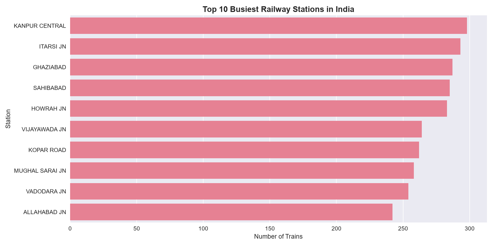
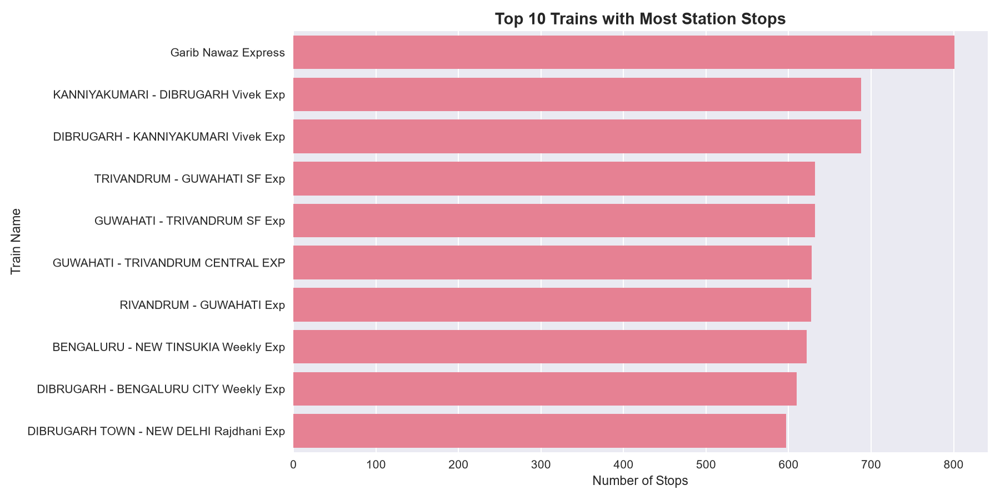
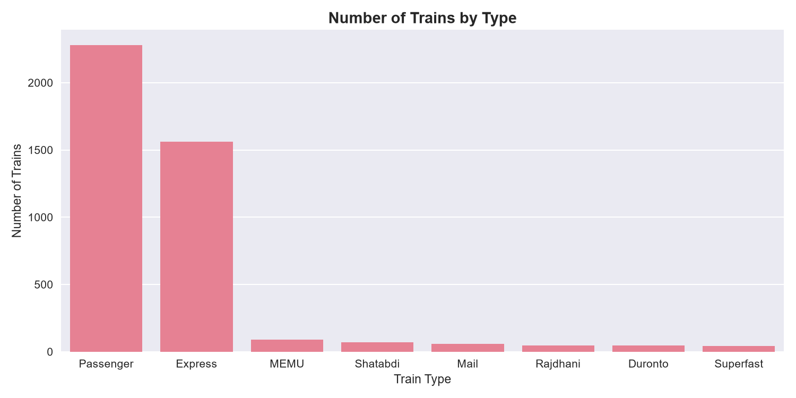
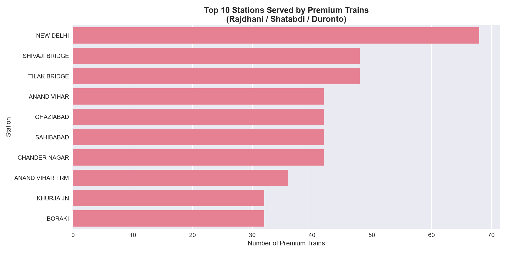
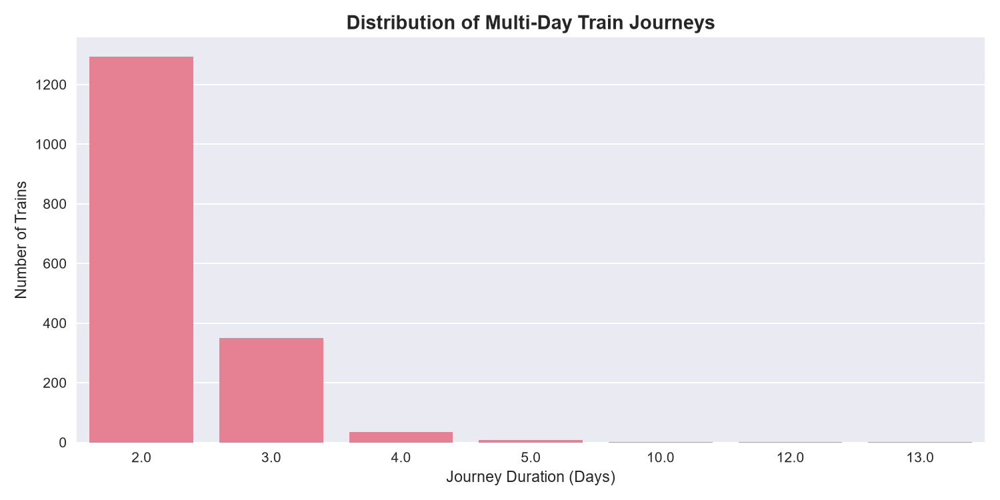

# 🚂 Indian Railways Schedule Analysis

A data analysis project exploring schedule patterns across
Indian Railways — one of the largest railway networks in the world.

---

## 📌 Project Overview

**Dataset:** Indian Railways Schedule Data  
**Source:** [Kaggle](https://www.kaggle.com/datasets/sripaadsrinivasan/indian-railways-dataset)  
**Tools:** Python, Pandas, Matplotlib, Seaborn  
**Author:** Utsav  

---

## 📊 Dataset Summary

| Metric | Value |
|---|---|
| Total schedule records | 4,17,080 |
| Unique trains | 5,208 |
| Unique stations | 8,495 |

---

## ❓ Questions Answered

### 1. Which are the busiest stations in India?

**Kanpur Central** is the busiest railway station in India
with **298 trains** stopping here — making it a critical
junction connecting North India routes.

### 2. Which trains have the longest routes?

**Garib Nawaz Express** has the longest route with
**801 station stops** — covering an extraordinary
number of stations across its journey.

### 3. What types of trains exist?

**Passenger trains** are the most common type with
**2,279 trains** — serving smaller towns and villages
that Express trains don't cover. Express trains form
the second largest category, connecting major cities.

### 4. Which stations are premium train hubs?

**New Delhi** is the top premium train hub with
**68 Rajdhani, Shatabdi and Duronto trains** — 
reflecting its status as India's capital and primary
rail gateway.

### 5. How many trains run multi-day journeys?

**1,688 trains** run for more than 1 day.
The longest journey spans an incredible **13 days** —
highlighting the vast geographical scale of
Indian Railways.

---

## 💡 Key Insights

1. **Kanpur Central beats Mumbai and Delhi** as the
   single busiest station by number of trains —
   showing the importance of UP as a rail hub.

2. **Garib Nawaz Express covers 801 stops** — this is
   a hyperlocal train serving hundreds of small towns
   that would otherwise have no rail connectivity.

3. **Passenger trains (2,279) outnumber Express trains**
   — Indian Railways prioritises accessibility over speed,
   connecting rural India at affordable prices.

4. **New Delhi dominates the premium network** with 68
   premium trains — almost every Rajdhani originates
   or terminates at New Delhi.

5. **1,688 trains run multi-day journeys** with the
   longest taking 13 days — a reminder of how
   geographically vast India really is.

---

## 🛠️ How to Run

1. Clone the repo:
git clone https://github.com/UTSAV2006/data-learning.git

2. Navigate to project folder:
cd data-learning/indian-railways-analysis

3. Install dependencies:
pip install pandas numpy matplotlib seaborn

4. Open the notebook:
jupyter notebook Indian_railways_analysis.ipynb

---

## 📁 Files

| File | Description |
|---|---|
| `Indian_railways_analysis.ipynb` | Main analysis notebook |
| `schedules.json` | Raw schedule data (4,17,080 records) |
| `trains.json` | Train route geodata |
| `stations.json` | Station location geodata |
| `busiest_stations.png` | Top 10 busiest stations chart |
| `longest_routes.png` | Top 10 longest routes chart |
| `train_types.png` | Train type distribution chart |
| `premium_trains.png` | Premium train hubs chart |
| `multi_day_journeys.png` | Multi-day journey chart |

---

*This project is part of my data science learning journey.*  
*[View my full learning repo](https://github.com/UTSAV2006/data-learning)*